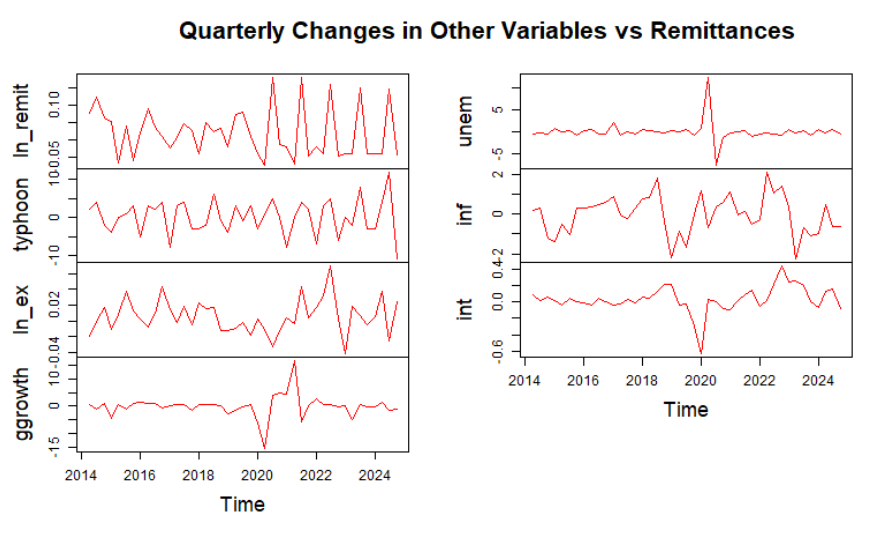
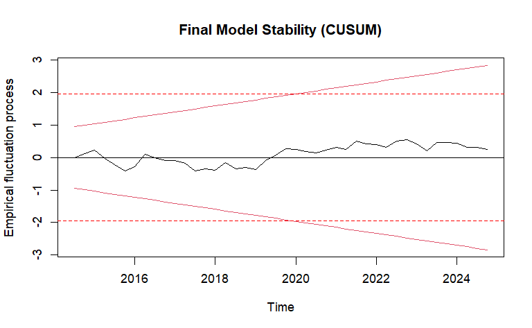

# ARDL Modeling of Philippine Remittances

## Project Overview
This project performs a time-series analysis of cash remittances to the Philippines from Q1 2014 to Q4 2024. Using an Autoregressive Distributed Lag (ARDL) model, it investigates the determinants of remittance inflows, specifically testing the "Insurance Hypothesis"—whether migrants send more money in response to natural disasters (typhoons) and domestic unemployment.

## Repository Structure
* `analysis.Rmd`: The main RMarkdown file containing the data processing, modeling, and diagnostics.
* `data/`: Contains the cleaned quarterly dataset (`remittances_data.xlsx`).
* `output/`: Generated reports and figures.

## Key Findings
* **Typhoons:** A statistically significant immediate positive effect on remittances, supporting the role of remittances as a disaster "safety net."
* **Unemployment:** A significant positive response to lagged unemployment, suggesting migrants react to economic distress with a one-quarter delay.
* **Seasonality:** Strong seasonal spikes observed in Q3.

## 📊 Econometric Results

### 1. Final Model Output (ARDL V3)
The model explains approximately 96% of the variance in quarterly remittances. Below are the key coefficients from the final estimation:

| Variable | Coefficient | p-value | Interpretation |
| :--- | :--- | :--- | :--- |
| **Remittances (t-1)** | **0.6276*** | < 0.001 | Strong inertia; past remittances predict future flows. |
| **Typhoon (t)** | **0.0063.** | 0.053 | **Safety Net:** Immediate positive spike during disaster quarters. |
| **Unemployment (t-1)** | **0.0127*** | 0.029 | **Insurance:** 1% rise in unemployment increases remittances by ~1.2% (lagged). |
| **Q3 Dummy** | **0.0723*** | 0.028 | **Seasonality:** Significant increase in Q3 (Tuition/Pre-holiday). |

*(Significance codes: '***' 0.001 '**' 0.01 '*' 0.05 '.' 0.10)*

### 2. Data Transformation (Stationarity)
To ensure robust results, variables were differenced to remove unit roots. The plot below visualizes the "shocks" (Quarterly Changes), clearly highlighting the volatility of Typhoons and the structural break caused by COVID-19 in 2020.

### 3. Structural Stability Testing
Given the massive economic shock of COVID-19, I performed a **CUSUM test** to ensure the model parameters didn't "break." As seen below, the recursive residuals (black line) remain strictly within the 5% critical bounds (red lines), confirming the model is stable and reliable.

